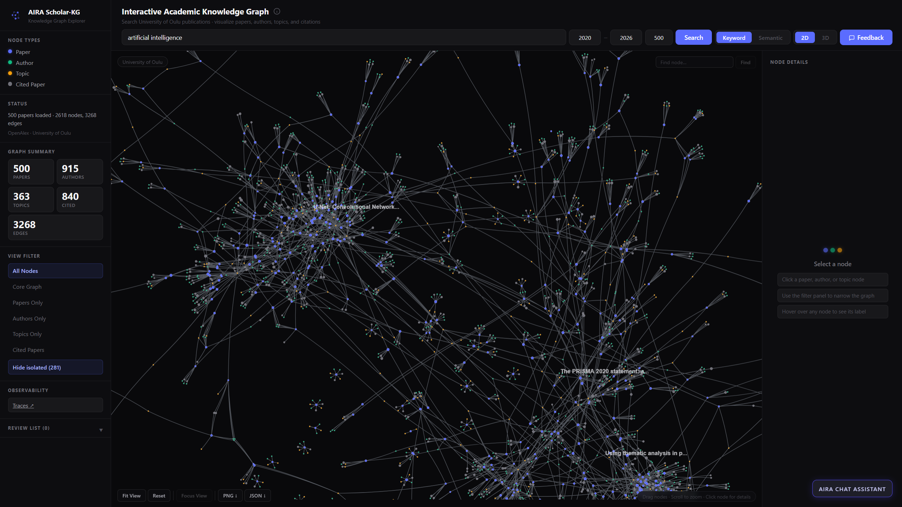

# AIRA Scholar-KG

AIRA Scholar-KG is an interactive Knowledge Graph application for exploring University of Oulu publications through papers, authors, topics, and citation relationships.

The project extends the AIRA Scholar research assistant idea with an interactive, graph-based exploration layer, a grounded AI chat assistant, and observability/tracing for the assistant's behavior.

**Live deployment:** http://86.50.20.161



---

## Current Status

This is a deployed, working full-stack application, not just a local prototype.

The system can:

* Search University of Oulu-related publications by topic, with a year range and result count filter
* Merge publication data from five academic sources into a single graph (see Data Sources below)
* Visualize papers, authors, topics, and cited papers as an interactive force-directed graph (2D and 3D view modes)
* Show paper details such as year, citation count, venue, authors, DOI, and OpenAlex link
* Show author details including OpenAlex/ORCID profile links, works/citation/h-index counts, affiliation, research topics, and recent publications
* Highlight connected nodes when a node is clicked, and explain *why* two nodes are connected (shared authors, shared topics, or direct citations) via a "Citation & Connection Explanation" panel
* Filter the graph by node type, and toggle between keyword and semantic search
* Find a specific node by name, cycling through multiple matches
* Show live graph summary statistics (paper/author/topic/citation/edge counts)
* Export the current graph as a PNG image or a JSON data file
* Load full text for open-access papers (via Crossref TDM links) and answer questions grounded in that full text
* Chat with the AIRA Assistant, grounded in the retrieved graph/paper data rather than general model knowledge
* Add papers to a Review List for later reference
* Submit feedback via an in-app Feedback button linking to an external form
* View an in-app "How to use this" instructions panel for first-time users

---

## Tech Stack

### Frontend

* React
* TypeScript
* Vite
* Custom force-directed graph visualization (2D/3D)

### Backend

* Python
* FastAPI
* Uvicorn
* HTTPX
* SQLite (local caching and persistence layer)
* Qdrant (semantic/vector search over publications)
* sentence-transformers (embeddings for semantic search)
* PyMuPDF (full-text PDF extraction)
* LangGraph (chat assistant's routing/context/answer pipeline)
* Langfuse (observability and tracing for the chat assistant)

### AI Assistant

* Default provider in production: OpenAI (gpt-4o)
* Also supports Google Gemini and local Ollama models, selectable via configuration
* All chat requests are traced via Langfuse (question, context, model, answer, latency, cost)

---

## Data Sources

Publication data is merged from five sources. OpenAlex provides the base set of papers/works; the other four sources enrich those same papers with additional metadata (matched by DOI) rather than contributing separate paper lists:

| Source | Role |
| --- | --- |
| OpenAlex | Primary source — the actual papers, authors, topics, and citation graph |
| Crossref | Adds publisher, ISSN, license, and funder metadata; used to locate full text for open-access papers |
| Semantic Scholar | Adds recommended/related papers and additional metadata |
| arXiv | Adds preprint metadata for papers with an arXiv link |
| OpenAIRE (Scholexplorer) | Adds linked datasets, software, and funding/project information |

The backend filters publications connected to the University of Oulu using:

```text
authorships.institutions.ror:https://ror.org/03yj89h83
```

---

## Knowledge Graph Structure

### Node Types

| Node Type   | Meaning                                     |
| ----------- | -------------------------------------------- |
| Paper       | Main University of Oulu-related publication |
| Author      | Author connected to a paper                  |
| Topic       | Topic connected to a paper                   |
| Cited Paper | Paper referenced by a main paper             |

### Edge Types

| Edge Type | Meaning                     |
| --------- | --------------------------- |
| AUTHOR_OF | Author wrote the paper      |
| HAS_TOPIC | Paper is related to a topic |
| CITES     | Paper cites another paper   |

---

## Chat Assistant Architecture

The chat assistant's logic is implemented as a lightweight LangGraph pipeline (not the full multi-agent architecture from earlier planning documents):

1. **Route question** — determines whether a question can be answered directly from existing data, requires numeric/results-specific full-text context, or needs general graph context.
2. **Build context** — assembles the relevant context for the question (candidate sentences from full text, or general graph/node context), or resolves directly without calling the model for simple factual questions.
3. **Generate answer** — calls the configured LLM provider (OpenAI, Gemini, or Ollama) with the assembled context.

Every model call and chat request is traced via Langfuse, viewable from the "Traces" link in the app's sidebar.

---

## Project Structure

```text
aira-scholar-kg/
├── backend/
│   ├── main.py
│   ├── db.py
│   ├── requirements.txt
│   └── .env
├── public/
├── src/
│   ├── App.tsx
│   ├── App.css
│   ├── assets/
│   │   └── logo.png
│   └── main.tsx
├── .env.production
├── .gitignore
├── package.json
├── README.md
└── vite.config.ts
```

---

## How to Run Locally

You need two terminals: one for the backend and one for the frontend.

### 1. Run Backend

```powershell
cd backend
python -m venv .venv
.\.venv\Scripts\Activate.ps1
python -m pip install --upgrade pip
pip install -r requirements.txt
python -m uvicorn main:app --reload
```

Backend runs at:

```text
http://127.0.0.1:8000
```

API docs (useful for manually testing endpoints):

```text
http://127.0.0.1:8000/docs
```

Required environment variables in `backend/.env`:

```text
LLM_PROVIDER=openai
OPENAI_API_KEY=...
OPENAI_MODEL=gpt-4o
GEMINI_API_KEY=...
GEMINI_MODEL=...
OPENALEX_API_KEY=...
SEMANTIC_SCHOLAR_API_KEY=...
QDRANT_HOST=...
QDRANT_PORT=6333
QDRANT_API_KEY=...
QDRANT_COLLECTION=...
LANGFUSE_PUBLIC_KEY=...
LANGFUSE_SECRET_KEY=...
LANGFUSE_HOST=...
```

### 2. Run Frontend

Open a new terminal from the project root:

```powershell
npm install
npm run dev
```

Frontend usually runs at:

```text
http://localhost:5173
```

For a production build, `VITE_API_BASE_URL` is read from `.env.production` (not `.env`), and should point to the deployed backend's public URL.

---

## Main API Endpoints

```http
GET  /graph/openalex/oulu     # Main graph-building endpoint (multi-source merge)
POST /chat                    # Chat assistant (routed through the LangGraph pipeline)
GET  /chat/status              # Returns the currently configured provider/model
```

Example graph request:

```text
http://127.0.0.1:8000/graph/openalex/oulu?limit=100&search=artificial%20intelligence&from_year=2020&to_year=2026
```

Query parameters:

| Parameter | Example                 | Description            |
| --------- | ----------------------- | ----------------------- |
| limit     | 100                     | Number of main papers    |
| search    | artificial intelligence | Topic/author/title search |
| from_year | 2020                    | Start year               |
| to_year   | 2026                    | End year                 |

The app's default search fields are pre-filled with `from_year=2020`, `to_year=2026`, and `limit=100` so users can search immediately without configuration.

---

## Deployment

The application is deployed on CSC cPouta (Finnish research cloud):

* Public URL: http://86.50.20.161
* Backend runs as a systemd service (`aira-backend`), auto-restarting on crash or reboot
* nginx serves the built frontend and reverse-proxies API requests to the backend
* Deployment is manual (tar/scp/SSH), not git-based — there is no CI/CD or git remote configured for this project at this time

Deploying an update:

```powershell
tar --exclude=node_modules --exclude=.venv --exclude=venv --exclude=__pycache__ --exclude=dist --exclude=*.pem --exclude=*.tar.gz -czf project.tar.gz .
scp -i "aira-web.pem" project.tar.gz ubuntu@86.50.20.161:~/
```

```bash
ssh -i "aira-web.pem" ubuntu@86.50.20.161
cd ~/aira-scholar-kg
tar -xzf ~/project.tar.gz -C ~/aira-scholar-kg --strip-components=1
cd backend && source .venv/bin/activate && pip install -r requirements.txt
cd .. && npm install && npm run build
sudo systemctl restart aira-backend
```

<!-- ---

## Current Limitations

* The site is served over plain HTTP; there is no HTTPS/TLS certificate configured yet.
* Rate limiting is not implemented on `/chat` or `/search`.
* The `/debug/*` endpoints are not gated behind authentication or an environment flag.
* Full text is only loaded from open-access links found via Crossref; the system does not bypass paywalls.
* There is no DOI-based "add paper manually" search entry point yet.
* Metadata quality depends on the coverage and accuracy of the underlying data sources.
* The chat assistant's LangGraph pipeline is intentionally lightweight (a router, a context-builder, and an answer step) rather than the full multi-agent (Planner/Retrieval/Writer/Critic) architecture described in earlier planning documents. -->

<!-- ---

## Next Steps

* Add security hardening (rate limiting, `/debug` gating, input validation)
* Add HTTPS
* Add a DOI-based manual paper search/add feature
* Review related work on scholarly Knowledge Graphs, GraphRAG, academic search, and agentic research assistants
* Incorporate user study feedback into the paper and the application -->

<!-- --- -->

<!-- ## Author

**Eshmam Rayed**

MSc student, University of Oulu

Project: AIRA Scholar-KG — Knowledge Graph Extension for Agentic Academic Research Exploration -->